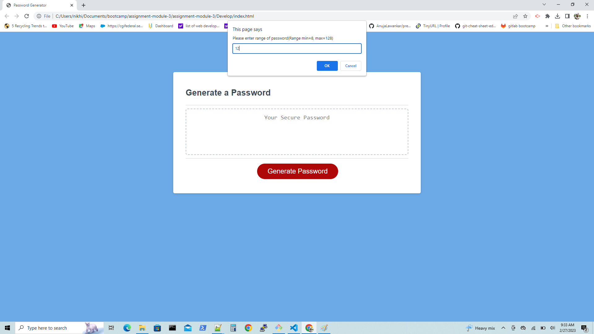
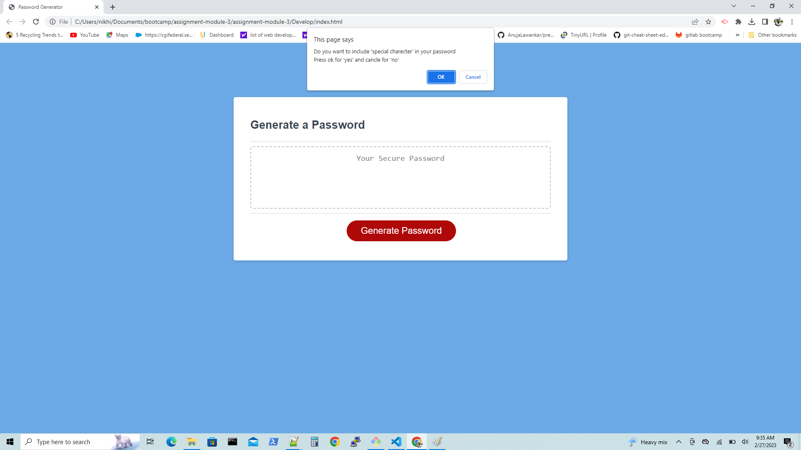
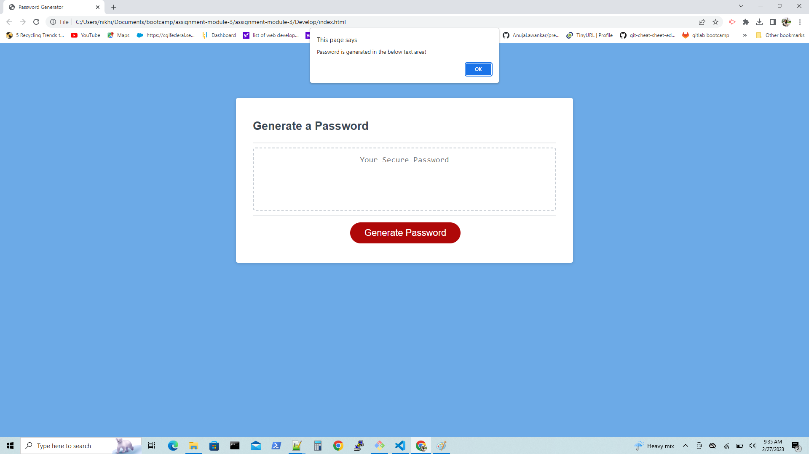
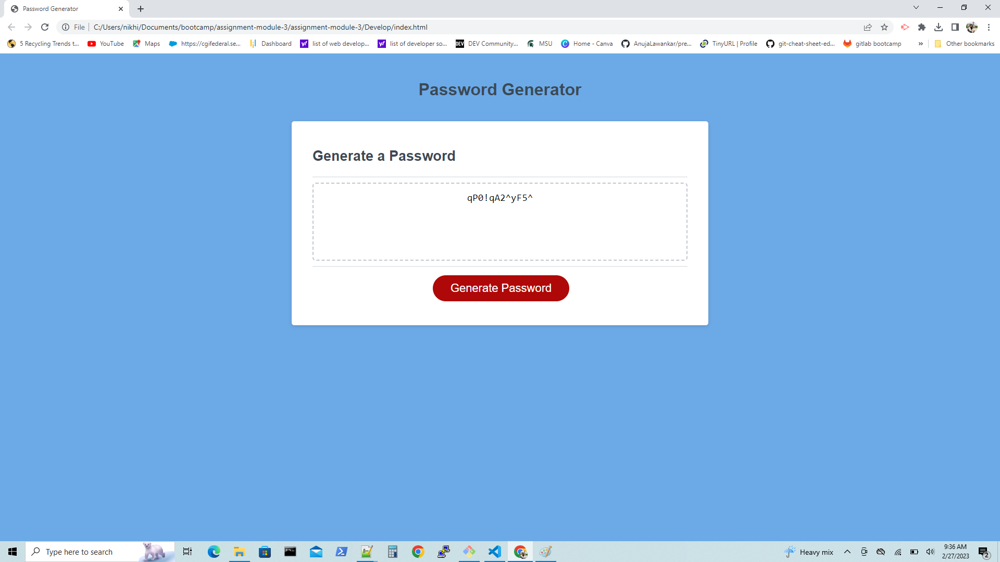
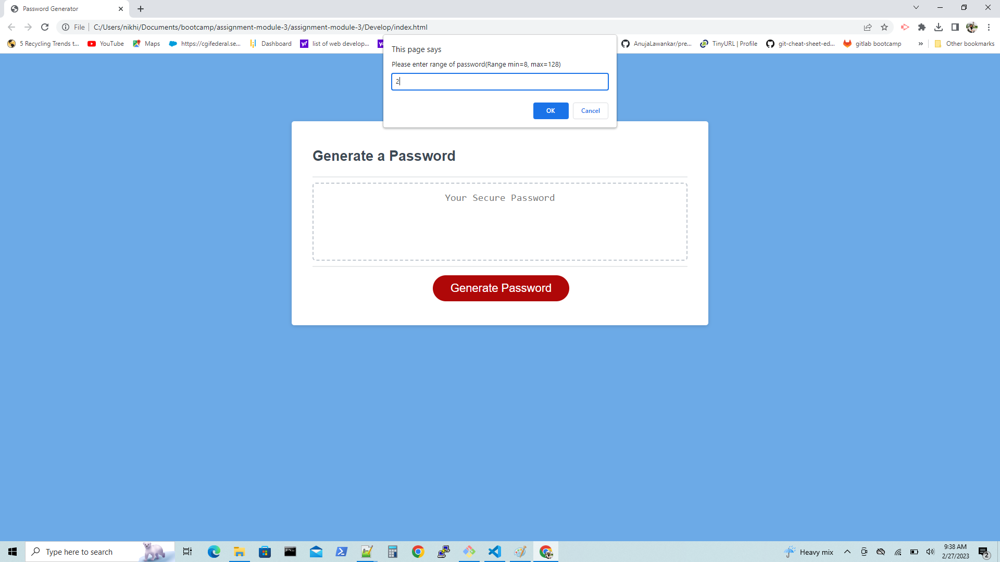
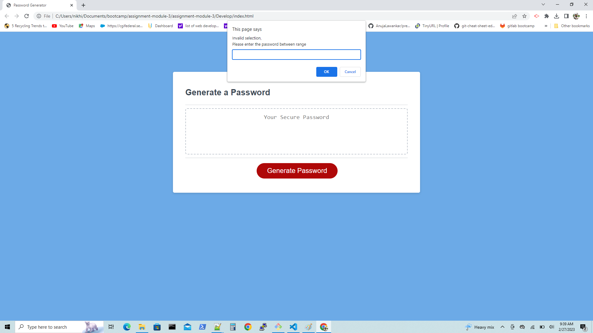

# Password Generator Starter Code

## Description
 In Password Generator web application the password is generated accroding to the input certiria of the user. There are many options for the user to select the password cretiria like,
 
1. First enter the length of password. The length of password should be at least 8 characters and no more than 128 characters.

2. If the user enter the out of range length. Then the password generator show the alert message of "Invalid selection, Please enter the password between range".

3. When the user enter the between the range then the next prompt displayed for selection of the lowercase characters.

4. If user want to add lowercase characters in their password than they can select "Ok" button or exclude lowercase characters in their password than they can select "Cancle".

5. User can select "ok" or "cancle" button for the first selection of lowercase.

6. Next, selection for uppercase characters. If user want to add uppercase characters in their password than they can select "Ok" button or exclude uppercase characters in their password than they can select "Cancle".
   
7. Next, selection for numeric characters. If user want to add special characters in their password than they can select "Ok" button or exclude numeric characters in their password than they can select "Cancle".

8.  Next, selection for specialcase characters. If user want to add number in their password than they can select "Ok" button or exclude special case characters in their password than they can select "Cancle".
   
9. If the user selected all the "Cancle" button among the selection certiria. Then the alert message display "Please select atleast one characters".

10. If the user selected any of the among the selection certiria. Then accroding to that certiria the password will be generated. The password is generated as long the password range input.

11. The generated password will be displayed in the web application.

## URLs:-
Here, you can find the webpage.
Paswword generator web application's URL:- 

Here, you can find the GitHub url.

GitHub URL:- 

## Installation

N/A

## Usage

N/A

## Credits

N/A

## License

N/A

## Assets

The following image demonstrates the website appearance:
1. Taking password range input.

2. Asking user for include lowercase characters.

3.Asking user for include uppercase characters.

4. Asking user for include numeric characters.

5. Asking user for include specialcase characters.

6. Password generated according to selection certiria,   Password generated as long the password range in input.

7. Password generated

8. Validation:- User enter out of password range input.

9. Error message and asking to re-enter password range input.
